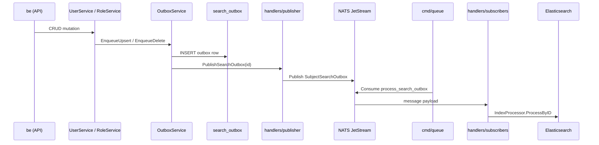

# BE Implementation: Elasticsearch Search

**Feature ID:** `002-elasticsearch-search`  
**Scope:** Search index sync, admin search API, queue worker

## Overview

Admin mutations (users, roles, permissions) enqueue rows in PostgreSQL `search_outbox`. The API publishes a lightweight trigger to NATS JetStream. A separate **`cmd/queue`** process ensures streams/consumers and processes messages into Elasticsearch.

The HTTP API **never** runs in-process outbox workers or NATS consumers.

## Layer map

```text
HTTP:  public/routes → public/handlers → internal/services → repository → PostgreSQL
Sync:  services (OutboxService) → handlers/publisher → internal/queue → NATS JetStream
Worker: cmd/queue → queue (EnsureInfrastructure + StartConsumers) → handlers/subscribers → IndexProcessor → Elasticsearch
```

## Directory layout

```text
be/internal/
├── queue/
│   ├── constants.go       # Stream, subject, consumer, handler names (single source of truth)
│   ├── nats.json          # JetStream options only (retention, ack_wait, …)
│   ├── config.go          # Load JSON + NATS_ENABLED / NATS_URL env overrides
│   └── nats.go            # Connect, EnsureInfrastructure, StartConsumers, Publish
├── handlers/
│   ├── publisher/
│   │   └── publisher.go   # PublishSearchOutbox → queue.SubjectSearchOutbox
│   └── subscribers/
│       ├── process_search.go
│       └── registry.go    # Maps handler name → queue.Handler
├── search/                # Elasticsearch client + document types
└── services/search/
    ├── outbox_service.go  # PG outbox + call publisher
    ├── index_processor.go # Process outbox row → ES upsert/delete
    └── search_service.go  # Admin search query + RBAC filter

be/cmd/
├── queue/main.go          # Queue worker (replaces search-worker)
└── reindex/main.go        # One-shot bulk reindex CLI
```

## Dependency injection (`internal/app/dependency/`)

Application wiring is split from business services:

| Resolver | Creates | Notes |
|----------|---------|-------|
| `infra.go` | Queue client, JWT, publisher, ES client | Shared process infrastructure |
| `search.go` | Outbox, index processor, search query service | Single outbox instance shared by user/role mutations |
| `auth_service.go` | Auth + OAuth services | Own auth/user/role repos |
| `user_service.go` | UserService | User repo + shared outbox |
| `role_service.go` | RoleService + role repo | Role repo also exposed on `Container` for auth middleware |
| `permission_service.go` | PermissionService | Permission repo |
| `handlers.go` | HTTP handlers | Maps resolved services to `public/handlers` |

`container.go` calls resolvers in order and keeps the public `app.Container` fields unchanged for routes, `cmd/queue`, and tests.

## Constants (`internal/queue/constants.go`)

All fixed NATS identifiers live in one file. **Do not** use string literals for subjects or consumer names elsewhere.

| Constant | Value | Usage |
|----------|-------|-------|
| `StreamKeySearch` | `search` | Key in `nats.json` → `streams` |
| `StreamSearch` | `SYSTEM_SEARCH` | JetStream stream name |
| `SubjectSearchOutbox` | `system.search.outbox` | Publish + consumer filter |
| `SubjectSearchWildcard` | `system.search.>` | Stream subject pattern |
| `ConsumerSearchOutbox` | `process_search_outbox` | Durable consumer name |
| `HandlerSearchOutbox` | `process_search_outbox` | Subscriber registry key |
| `ConsumerKeySearchOutbox` | `search_outbox` | Key in `nats.json` → `consumers` |

## Configuration

| Source | Purpose |
|--------|---------|
| `internal/queue/nats.json` | Connection defaults + JetStream **options** (not names) |
| `NATS_ENABLED` | Override `connection.enabled` |
| `NATS_URL` | Override `connection.url` |
| `QUEUE_CONFIG_FILE` | Alternate path to JSON (default: `internal/queue/nats.json`) |
| `ELASTICSEARCH_ENABLED` / `ELASTICSEARCH_URL` | ES client (`config.yaml` + env) |

Names (stream, subject, consumer) come from **constants**, not from JSON.

## Runtime processes

| Process | Command | NATS role |
|---------|---------|-------------|
| API | `go run .` / Docker `be` | Publish only (via `handlers/publisher`) |
| Queue worker | `go run ./cmd/queue` / Docker `queue` | Ensure stream/consumer + consume |
| Reindex CLI | `go run ./cmd/reindex` | No NATS; direct ES bulk |

When `NATS_ENABLED=false`, the publisher no-ops and `cmd/queue` falls back to polling `search_outbox` every 2s.

## Sync flow



## Admin search API

- `GET /api/admin/search` — JWT + admin auth; results filtered by entity view permissions (`users:view`, `roles:view`, `permissions:view`). No dedicated `search:view` permission.
- `POST /api/admin/search/reindex` — bulk reindex
- Outbox stats / replay endpoints on `SearchHandler`

## Adding a new queue consumer

1. Add constants in `internal/queue/constants.go` (stream key, subject, consumer, handler).
2. Add JetStream options under the stream in `internal/queue/nats.json`.
3. Extend `resolveStream` / `resolveConsumer` in `internal/queue/config.go`.
4. Add publish method + payload type in `internal/handlers/publisher/`.
5. Add handler in `internal/handlers/subscribers/` and register in `registry.go`.
6. Call publisher from the relevant service after DB write.
7. Run `make test-be`; verify with `docker compose up queue be`.

## Docker services

| Service | Role |
|---------|------|
| `elasticsearch` | Search index |
| `nats` | JetStream broker |
| `be` | HTTP API + outbox publish |
| `queue` | Stream/consumer bootstrap + subscriber loop |

## Tests

- Unit: `be/test/unit/search/`
- Run: `make test-be` from repo root (Docker `be` container)

## Related docs

- [spec.md](spec.md) — requirements
- [be/AGENTS.md](../../../be/AGENTS.md) §12 — queue rules for agents
- [be/README.md](../../../be/README.md) — commands and env
