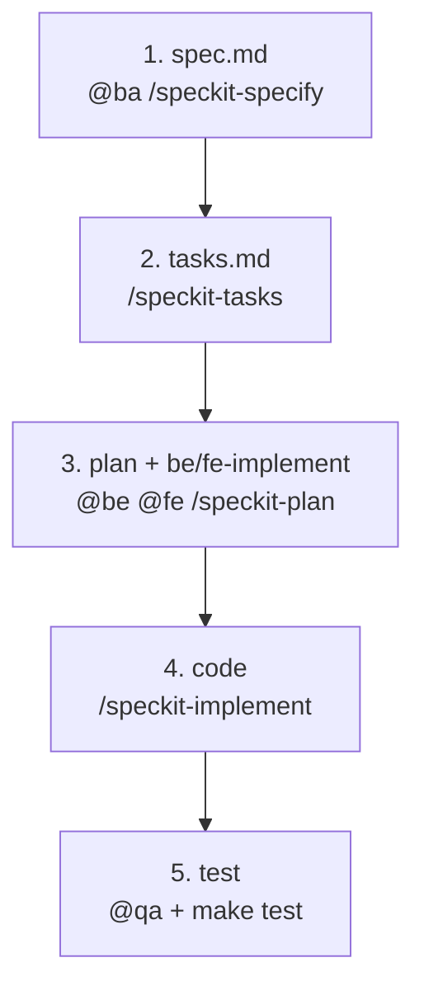

# Speckit workflow (SDD)

Feature docs under **`docs/features/`**. Flat files only — no role subfolders.

## Mandatory phase order

```text
1. ANALYZE   → spec.md
2. DECOMPOSE → tasks.md
3. DESIGN    → plan.md + be-implement.md + fe-implement.md
4. IMPLEMENT → be/ + fe/ code
5. TEST      → qa-checklist.md + make test
```



## Phase details

### 1. Analyze — `spec.md` (BA)

**Goal:** Understand the feature in business terms — no technical design yet.

- Command: `/speckit-specify`, optional `/speckit-clarify`
- Agent: `@ba`
- Contains: user stories, acceptance criteria, scope, edge cases
- **Gate:** No `tasks.md`, `plan.md`, or code until spec is reviewed

### 2. Decompose — `tasks.md` (all roles, from spec)

**Goal:** Break the feature into ordered work items — still no deep technical design.

- Command: `/speckit-tasks` — **read `spec.md` only** (project override: tasks before plan)
- Output: high-level tasks with `[BA]` `[BE]` `[FE]` `[QA]` prefixes
- **Gate:** No `plan.md` or implement until tasks exist

### 3. Design — `plan.md` + implement docs (BE, FE)

**Goal:** Technical design **last** before writing code — how each task will be executed.

- Command: `/speckit-plan` — input: **`spec.md` + `tasks.md`**
- Agents: `@be` → `be-implement.md`, `plan.md` (BE sections); `@fe` → `fe-implement.md`
- Contains: API, data model, routes, UI flows, file paths in `be/` and `fe/`
- **Gate:** No `/speckit-implement` until plan + implement docs are complete

### 4. Implement — `be/`, `fe/`

- Command: `/speckit-implement` — execute `tasks.md` using `plan.md` and `*-implement.md`
- Agents: `@be` for `[BE]` tasks, `@fe` for `[FE]` tasks

### 5. Test — `qa-checklist.md`

- Command: `/speckit-checklist`, run `make test` from repo root
- Agent: `@qa`
- Verify acceptance criteria from `spec.md`; sign off in `qa-checklist.md`

## Feature files reference

| File | Phase | Owner |
|------|-------|-------|
| `spec.md` | 1 | BA |
| `tasks.md` | 2 | BA + BE + FE |
| `plan.md` | 3 | BE / FE |
| `be-implement.md` | 3 | BE |
| `fe-implement.md` | 3 | FE |
| `qa-checklist.md` | 5 | QA |

## Feature state

`.specify/feature.json`:

```json
{ "feature_directory": "docs/features/003-user-auth" }
```

## Constitution

`.specify/memory/constitution.md` — phase gates before implement.

## Language

All artifacts in this workflow are **English in files**. Prompt `@ba` in Vietnamese if you want — output `spec.md` etc. must still be English.

## Note on Speckit defaults

Upstream Spec Kit often runs **plan → tasks**. This project runs **tasks → plan** so work is decomposed from the spec first, then designed in detail before code.
