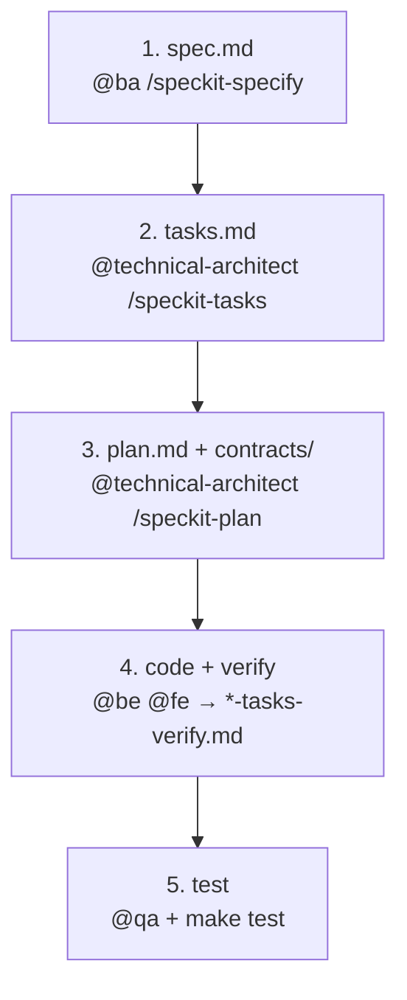

# Speckit workflow (SDD)

Feature docs under **`docs/features/`**. No role subfolders. Nested **`contracts/`** holds database + endpoints (architect-owned).

## Mandatory phase order

```text
1. ANALYZE   → spec.md
2. DECOMPOSE → tasks.md
3. DESIGN    → plan.md + contracts/{database,endpoints,permissions}.md
4. IMPLEMENT → be/ + fe/ code → be-tasks-verify.md / fe-tasks-verify.md
5. TEST      → qa-checklist.md + make test
```


```mermaid
flowchart TD
  S["1. spec.md<br/>@ba /speckit-specify"]
  T["2. tasks.md<br/>@technical-architect /speckit-tasks"]
  P["3. plan.md + contracts/<br/>@technical-architect /speckit-plan"]
  I["4. code + verify<br/>@be @fe → *-tasks-verify.md"]
  Q["5. test<br/>@qa + make test"]
  S --> T --> P --> I --> Q
```

## Phase details

### 1. Analyze — `spec.md` (BA)

**Goal:** Understand the feature in business terms — no technical design yet.

- Command: `/speckit-specify`, optional `/speckit-clarify`
- Agent: `@ba`
- Contains: user stories, acceptance criteria, scope, edge cases
- **Gate:** No `tasks.md`, `plan.md`, or code until spec is reviewed

### 2. Decompose — `tasks.md` (Technical Architect)

**Goal:** Break the feature into ordered work items — still no deep technical design.

- Command: `/speckit-tasks` — **read `spec.md` only** (project override: tasks before plan)
- Agent: `@technical-architect`
- Output: high-level tasks with `[BA]` `[BE]` `[FE]` `[QA]` prefixes
- **Gate:** No `plan.md` or implement until tasks exist

### 3. Design — `plan.md` + `contracts/` (Technical Architect)

**Goal:** Technical design **last** before writing code — how each task will be executed.

- Command: `/speckit-plan` — input: **`spec.md` + `tasks.md`**
- Agent: `@technical-architect` → `plan.md` + `contracts/{database,endpoints,permissions}.md`
- Contains: research decisions, structure, handoff in `plan.md`; schema; HTTP API; RBAC keys + admin menu gate
- Templates: `docs/templates/contracts/`
- **Gate:** No `/speckit-implement` until `plan.md` and all contract files are complete (N/A allowed inside a file when appropriate)

### 4. Implement + verify — `be/`, `fe/` → `*-tasks-verify.md`

- Command: `/speckit-implement` — execute `tasks.md` using `plan.md` + `contracts/*`
- Agents: `@be` for `[BE]` tasks, `@fe` for `[FE]` tasks
- BE seeds permissions in `catalog.go`; FE gates **sidebar** with `hasPermission` and pages with `PermissionGuard`
- After tasks are done: run package tests, then write **`be-tasks-verify.md`** / **`fe-tasks-verify.md`**
- **Do not** run `speckit-plan` / `speckit-tasks` from `@be` / `@fe`
- **Gate:** Verify docs must record a completed pass before `@qa` sign-off

### 5. Test — `qa-checklist.md`

- Command: `/speckit-checklist`, run `make test` from repo root
- Agent: `@qa`
- Verify acceptance criteria from `spec.md`; cross-check `be-tasks-verify.md` / `fe-tasks-verify.md`; sign off in `qa-checklist.md`

## Feature files reference

| File | Phase | Owner |
|------|-------|-------|
| `spec.md` | 1 | `@ba` |
| `tasks.md` | 2 | `@technical-architect` |
| `plan.md` | 3 | `@technical-architect` |
| `contracts/database.md` | 3 | `@technical-architect` |
| `contracts/endpoints.md` | 3 | `@technical-architect` |
| `contracts/permissions.md` | 3 | `@technical-architect` |
| `be-tasks-verify.md` | 4 | `@be` |
| `fe-tasks-verify.md` | 4 | `@fe` |
| `qa-checklist.md` | 5 | `@qa` |

## Feature state

`.specify/feature.json`:

```json
{ "feature_directory": "docs/features/003-user-auth" }
```

## Constitution

`.specify/memory/constitution.md` — phase gates before implement.

## Language

All artifacts in this workflow are **English in files**. Prompt `@ba` in Vietnamese if you want — output `spec.md` etc. must still be English.

## Note on Speckit defaults

Upstream Spec Kit often runs **plan → tasks**. This project runs **tasks → plan** so work is decomposed from the spec first, then designed in detail before code.
